## DAND Project 2 Investigate the Data Set of Titanic

### Liang Sun        
### January 4, 2017

*****

### Outline
- Introduction to the data set
- Statement of questions
- Description of investigation steps
- Data wrangling
- Results
- Codes for data analysis

******

### 1. Introduction to the data set

This project investigates a data set on the information of 891 passengers on a British liner named "Titanic" which sank in Atlantic Ocean on her maiden voyage from England to New York in 1912. There were 2,224 passengers and crew aboard, so the data set used here is an incomplete record of Titanic passengers.The data set  contains a variety of variables concerning passenger's age,gender, family, ticket, and survival infromation. The variables are listed as below:

<center>

| Variable Name |  Variable Description |
|---------------|-----------------------|
|PassengerID| Passenger ID|
|   Survived  |  Survival (0 = No;1 = Yes)|
|Pclass|Passenger Class (1 = 1st; 2 = 2nd; 3 = 3rd)|
|Name|Name|
|Sex|Sex|
|Age|Age|
|SibSp| Number of Siblings/Spouses Aboard|
|Parch|Number of Parents/Children Aboard|
|Ticket|Ticket Number|
|Fare|Passenger Fare|
|Cabin|Cabin|
|Embarked|Port of Embarkation (C = Cherbourg; Q = Queenstown; S = Southampton)|

</center>
****

### 2. Statement of questions

According to historical records, passengers were evacuated in lifeboats after Titanic started to sink. The only twenty lifeboats on the liner were supposed to accomodate 1,178 people but saved only about 600 lives. Anyway, not all passengers could have the chance to get in the lifeboats. It was reported that women and children were given priority to evacuate first. In addition, people in higher-class cabins had better access to the deck where lifeboats were equipped than people who stayed in third-class cabins which were on the lowest level in the ship. To sum up, the chance of survival may have been affected by a variety of factors, including gender, age, class and so on. Therefore, one of the questions to be answered by exploring this data set is what the relationship between these factors and one's chance of survival is. How did factors interact and co-determine the result.

What made it more tragical is that many passengers went on the trip with their family. As passengers were not evacuated in family unit, many of them would have had to choose between surviving or dying with family, which was a toughest and heartbreaking situation that no one could imagine. Survivors who went on the trip with their family may have been separated forever. For those who finally survived, how many of them have lost their family members?  

Given these thoughts, I will investigate the data set and answer the following questions:

- How do the summary statistics of passengers, including their age, gender, and class of ticket,vary by survival?
- What is the relationship between passenger's age and their chance of survival?
- What is the relationship between passenger's gender and their chance of survival?
- What is the relationship between passenger's ticket fare and their chance of survival?
- What is the relationship between passenger's class of cabin and their chance of survival?
- What is the relationship between port of embarkation and chance of survival?
- How did different factors interact in determining the chance of survival?
- How many survivors lost family members?


*****

### 3. Description of investigation steps

To investigate the questions stated above, I started with browsing the data structure and knowing what variables are included in the data, particularly the meaning and type of each variable and convert variables into format that is fit for data analysis.

Second, I explored the descriptive statistics of variables, mainly mean and standard deviation of each variable. I also checked how the descriptive statistics vary between survivors and non-survivors. The variables that showed evident difference between two groups are likely to have had an impact on chance of survival.

Third, I examined the relationship between possibly related variables by checking descriptive statistics and performing t-test. I also visualized the relationship between variables by drawing box plot, bar chart and histogram plot.  

In the whole process of investigation, I referred to online resources about Titanic historical records for a better understanding of how people survived or died in the disaster, so as to explain or support my findings from the data analysis. I also acquired solutions to tenical problems I came across in the coding process from websites of data and programming.

*******

### 4. Data wrangling

First, import packages that will be used in the data analysis:

 ```
 import matplotlib.pyplot as plt
 import numpy as np
 import pandas as pd

 %pylab inline  

 from scipy.stats import ttest_ind

 ```

Second, read the data file from csv file and save as a Pandas dataframe:
```
filename = 'C:/Users/Liang Sun/Documents/My NanoDegree/dandp2_project/titanic-data.csv'
titanic_df = pd.read_csv(filename)
```

Third, take a brief look at the data structure and variables,

```
titanic_df.head()
```
and notice that variable "Sex","Pclass", and "Embarked" are categorical.

Fourth, convert categorical variables into dummies:

   ```
   # "sex" is recoded as 1=female and 0=male

    def convert_sex(sex):
        if sex == 'female':
            sex = 1
        else:
            sex = 0
        return sex
    titan_df = titanic_df.copy()
    titan_df['Sex'] = titan_df['Sex'].apply(convert_sex)
    titan_df.head()
   ```

   ```
   # "Pclass","Embarked" are categorical, so we get their dummies for analysis

    class_dummies = pd.get_dummies(titan_df['Pclass'],prefix='class')
    embark_dummies = pd.get_dummies(titan_df['Embarked'],prefix='port')

   # and concate the data with columns of dummies

    titan_df = pd.concat([titan_df,class_dummies,embark_dummies],axis=1)
   ```

Finally, check the descriptive statistics of all variables, and notice any variables that have missing values,

   ```
    titan_df.describe()

    titan_df['Embarked'].count()
   ```

Variables "Age" and "Embarked" have missing values, which will be given certain attention to in the data analysis.

The dataframe ```titan_df``` is used as the main data set in the following data analysis.

********

### 5. Results
The results are presented in response to each of the questions stated above.

#### Question 1: Summary statistics
<center>
Table 1. Mean and standard deviation of main variables of full sample and subsamples by survival


<center>

|Variable | All Passengers | Not Survived | Survived|
|:--------:|:-----:|:--------:|:------------:|
|Female| 0.35 | 0.18 | 0.68 |
| |(0.48)|(0.35)|(0.47)|
|Age|29.70|30.63|28.34|
| |(14.53)|(14.17)|(14.95)|
|Fare|32.20|22.12|48.40|
| |(49.69)|(31.39)|(66.60)|
|1st Class|0.24|0.15|0.40|
| |(0.43)|(0.35)|(0.49)|
|2nd Class|0.21|0.18|0.25|
| |(0.41)|(0.38)|(0.44)|
|3rd Class|0.55|0.68|0.35|
| |(0.50)|(0.47)|(0.48)|
|Port Cherbourg|0.19|0.14|0.27|
| |(0.39)|(0.34)|(0.45)|
|Port Queenstown|0.09|0.09|0.09|
| |(0.28)|(0.28)|(0.28)|
|Port Southampton|0.72|0.78|0.63|
| |(0.45)|(0.42)|(0.48)|
|Number of Siblings/Spouse Aboard| 0.52|0.55|0.47|
| |(1.10)|(1.29)|(0.71)|
|Numer of Parents/Children Aboard|0.38|0.33|0.46|
| |(0.81)|(0.82)|(0.77)|
|*N_Age*|714|424|290|
|*N_Port*|889|549|340|
|*N*|891|549|342|

</center>
`Note: "Age" and "Port of Embarked" have missing values.`


From the summary statistics above, we can see that the total number of passengers in this data set is 891, among which 549 (61.62%) died in the disaster and 342(38.38%) survived.

A variety of factors may have determined who could survive from the disaster. It seems that survivors and non-survivors had difference in most of their characteristics, given the mean values in their gender, age, class and so on. Thus, I am going to perform further detailed analysis on the relationship between each factor and survival.

#### Question 2:  Relationship between gender and survival

First, a t-test is performed to test the significance of the difference between female and male in their chance of survival,and the result is significant(t-statistic=-19.298, p-value=0.000), which suggests that women had better chance to survive than men in this disaster.


Second, a bar chart is drawn to visualize the evident difference by gender in survival:

<p align="center">
 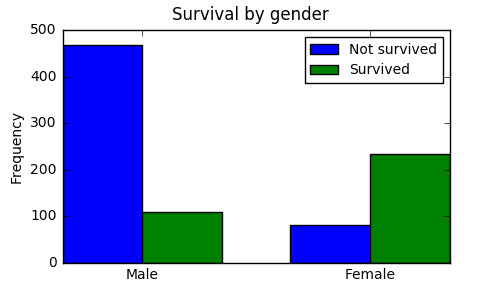


If we change our perspective to view the relationship between gender and survival, we can get a bar chart like this:

<p align="center">
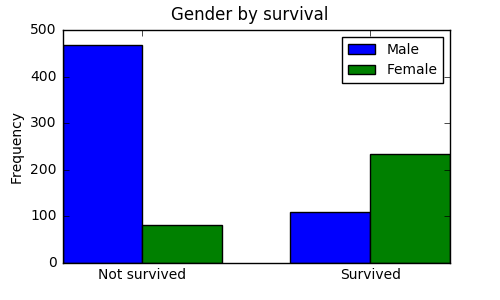


Both graphs reveal the same thing, that is, female passengers were given priority in evacuation and had higher survival rate.

#### Question 3: Relationship between age and survival

To begin with, a t-test is performed to test the difference of age mean between survivor and non-survivors.

The result (t-stat=2.067 and pvalue=0.039) suggests that the difference is significant, which means that survivors' average age is significantly smaller than non-survivors.

A box plot by survival group is created to show the difference:
<p align="center">
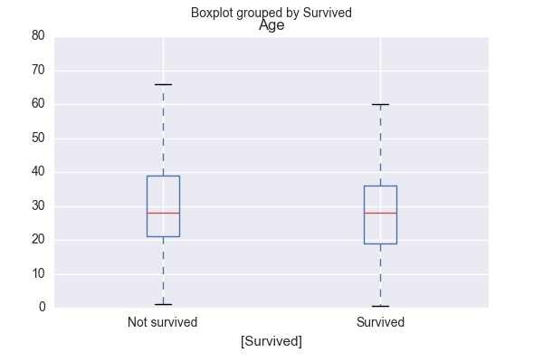

and a histogram plot displays the distribution of age of survivors and non-survivors:
<p align="center">
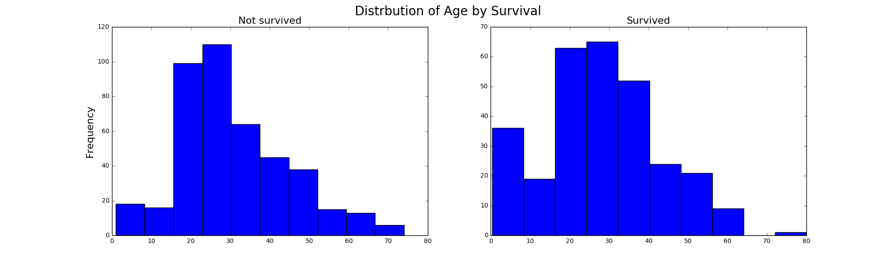

We can see that in the group of survivors, there are more passengers with age less than 20. It seems that younger passengers were likely to survive. Therefore, I am interested in comparing the survival rate between children (<=16 years old) and adults.

The t-test here also suggests a significant difference in the survival rate between children and adult (t-stat=2.067, p-value=0.039).

Moreover, a bar chart was depicted to display such difference:
<p align="center">
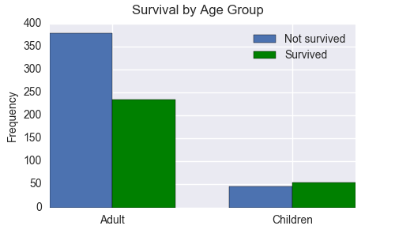

The higher rate of survival among children than that among adults proves that children were also given priority in evacuation.

#### Questions 4: Relationship between fare and survival

A t-test is conducted to compare the difference in the means of fare between non-survivors (mean=22.12) and survivors (mean=48.40). A significant result (t-stat=-7.939, p-value=0.000) suggests that survivors generally paid more than non-survivors did for their tickets.

A histogram is created to show the difference of fare between two groups:
<p align="center">
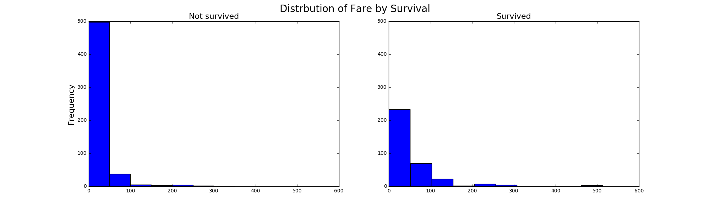

To understand how ticket fare is correlated with chance of survival, we need to further explore the factor--class of cabin, which was determined by the ticket price and probably had a more direct and crucial impact on one's access to the deck and lifeboat, given the fact that lifeboats were installed on the deck of the ship while cabins were ranked by order from upper to lower levels of the ship.

#### Question 5: Relationship between class of cabin and survival

First, I checked the mean of survival (which is also the survival rate) by class of cabin:

<center>

| Class| Mean of Survival|*N*|
|:-----:|:---------:|:-------:|
|1|0.623|216|
|2|0.473|184|
|3|0.242|491|

</center>
It seems that survival rate reduces from higher to lower class, so I performed a t-test to compare the difference between every two classes.

<center>

| Class| t-stat|p-value|
|:-----:|:---------:|:-------:|
| 1 vs 2|3.179|0.002|
| 1 vs 3|10.624|0.000|
| 2 vs 3|5.931|0.000|

</center>
Every class is significantly different from another.

A bar chart was drawn to show the difference between classes:

<p align="center">
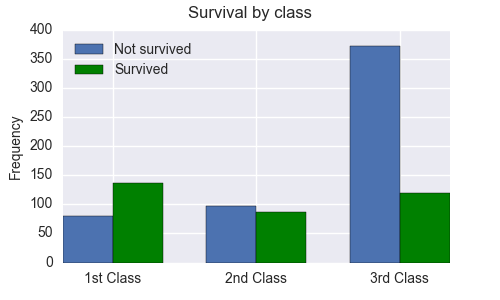

The death rate for the third class is so much higher than the first and second!

#### Question 6: Relationship between port of embarkation and survival
Port of embarkation does not seem to have a direct or causal relationship with survival, but I am curious about the role of port of embarkation and how it might be related to survival or determinants of survival.

Similarly, I got mean of survival for passengers from each port:

<center>

| Port| Mean of Survival|*N*|
|:-----:|:---------:|:-------:|
|Cherbourg|0.554|168|
|Queenstown|0.390|77|
|Southampton|0.337|644|

</center>
and t-test between means:

<center>

| Port| t-stat|p-value|
|:-----:|:---------:|:-------:|
| C vs Q|2.401|0.017|
| C vs S|5.226|0.000|
| Q vs S|0.919|0.358|

</center>
and a bar chart showing the difference:

<p align="center">
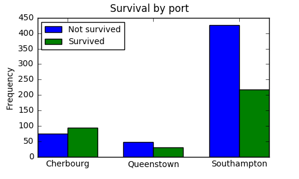

It seems that passengers from Cherbourg had higher chance of survival. How to explain this? Based on previous analysis, it is probably because port is correlated to other factors, such as gender, age, and class, which in fact determine their chance of survivial. So let's check how gender, age, and class vary by port.

<center>

| Port|Survival|Sex|Age|Class|Fare|
|:-----:|:---------:|:-------:|:---------:|:-------:|:-------:|
|Cherbourg|0.554|0.435|30.815|**1.887**|**59.954**|
|Queenstown|0.390|0.468|28.089|2.909|13.276
|Southampton|0.337|0.315|29.445|2.351|27.080

</center>
The evident difference between mean values of class and ticket fare here suggest passengers from Cherbourg were more likely to have bought first or second-class tickets than passengers from Queenstown and Southampton. I further plotted the number of passengers in each class by port:

<p align="center">
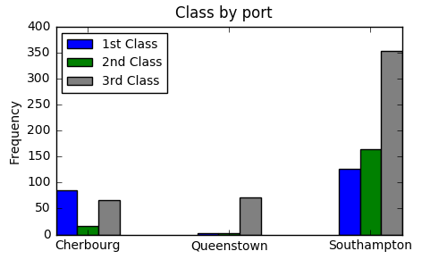

One may wonder why passengers from Cherbourg preferred first-class cabins. Although we do not have detailed background information of passengers who embarked from Cherbourg in the data, we know that Cherbourg is a port city in northwestern France and we can assume that a large proportion of the passengers who embarked from France might have had a different reason for taking the trip than working-class immigrants. By checking some of the passengers' names online, I found there were tourists, opera singer, publisher, jewller, banker and people of similar socioeconomic status, among those who embarked from Cherbourg.

Therefore, port of embarkation itself has no direct correlation with chance of survival, but passengers' class determines their chance of survival to a great extent.

#### Question 7: How did different factors interact in determining survival?

Since passengers in first-class cabins had better access to lifeboats and higher survival rate while women and children in general were given priority to evacuate, we may think, did women and children in lower-class cabins have same chance to get in lifeboats as those in first-class cabins?

- Interaction between gender and class

First, I created a subset of data with female observations only. The means of survival and age are grouped by class of cabin:

<center>

| Class| Survival|Age|*N*|
|:-----:|:---------:|:-------:|:-------:|
|1|0.968|34.612|85|
|2|0.921|28.723|74|
|3|0.500|21.750|102|

</center>
A t-test is conducted between the survival rate of every two classes:

<center>

| Class| t-stat|p-value|
|:-----:|:---------:|:-------:|
| 1 vs 2|1.361|0.175|
| 1 vs 3|8.694|0.000|
| 2 vs 3|6.804|0.000|

</center>
A bar chart is drawn to show the difference:

<p align="center">
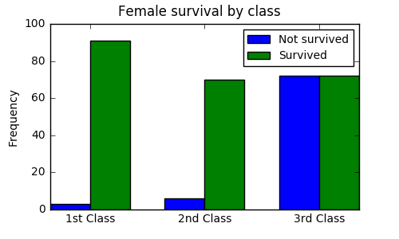

The statistics and graph above suggest that even though women in general were given priority to evacuate in lifeboat, they did not have equal chance to do so depending on which class of cabins they were in. Women in first and second-class cabins had much greater chance of survival than those in third-class cabins.

- Interaction between age and class

Children were also given priority to leave the ship, but did class also make the chance of survival unequal for children in different classes?

First, I created a subset of data with children only (<=16 years old), and the means of survival, sex, and age are:

<center>

| Class| Survival|Sex|Age|*N*|
|:-----:|:---------:|:-------:|:-------:|:-------:|
|1|0.889|0.667|10.547|9|
|2|0.905|0.476|5.635|21|
|3|0.400|0.471|8.392|70|

</center>
A t-test is conducted between the survival rate of every two classes:

<center>

| Class| t-stat|p-value|
|:-----:|:---------:|:-------:|
| 1 vs 2|-0.128|0.899|
| 1 vs 3|2.880|0.005|
| 2 vs 3|4.437|0.000|

</center>
A bar chart is drawn to show the difference:

<p align="center">
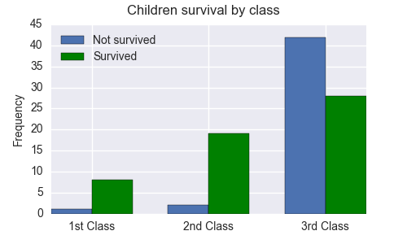

The statistics and graph above suggest that children in different cabins did not have equal chance to survive, similar to what we found about women.

In conclusion, although women and children had priority to evacuate first in general, their class largely intervened their chance to survive.

#### Question 8: Family loss of passengers who survived

Every passenger had a ticket number and family were likely to share an identical ticket number, so people with same ticket number and with family members on board can be generally identified as family.

Among 342 survivors, 72 (21.05%) lost family members in the disaster. More than half of them lost at least two family members.

<p align="center">
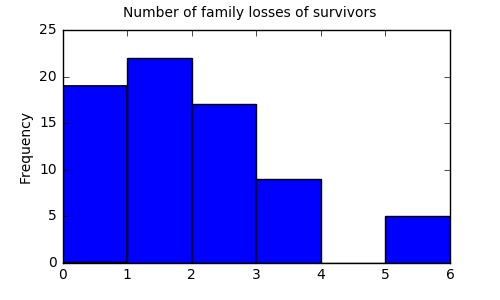

One limitation of the data is that we cannot differentiate between spouse and siblings, or between parents and children. If we know more specific information about family members, we could perform more detailed analysis of the relationship between survivors and non-survivors. For example, since women and children were given greater chance to survive, we may wonder how many of them lost their spouse or parents?  

The data only recorded family members including parents and children, spouses and siblings as two combined counts, which may have omitted other family members. I also notice that many peole shared the same ticket number but had no family relationship recorded. Such people might be relatives, friends, colleagues, companions and so on. Therefore, many survivors since then have lived in severe pain of losing people they loved or they knew, or suffered from the experience of having seen other passengers die in the disaster, as historical records depict.


#### Conclusion

The chance of survival from the Titanic disaster was determined by a variety of factors, mainly including gender, age, and class of cabin. These factors reveal two sides of the story, humanity and disparity. Because of humanity, women and children had better chance of survival than men, regardless of their background. Meanwhile, due to different socioeconomic status, more than half of the passengers in our data could only afford third-class cabins, which lethally reduced their chance of survival. However, humanity shines more because it shows how brave people made selfless decisions in the face of disaster. It is really heart-touching that many gentlemen gave away their chance of get in lifeboats and insisted on "ladies and children first."

It is hard to say which factor plays a more critical role from the data analysis here, but we can be certain that chance of survival is the result of a combination of various factors, and we can have better understanding of the pattern if more detailed information is available.

### 6. Codes for data analysis

Please check the "DAND_Project2_Titanic_code_for_analysis.ipynb" file uploaded to the repository.

### References

* Add a new column to dataframe http://stackoverflow.com/questions/16327055/how-to-add-an-empty-column-to-a-dataframe
* Bar chart https://pythonspot.com/matplotlib-bar-chart/
* Change values of a column http://stackoverflow.com/questions/12604909/pandas-how-to-change-all-the-values-of-a-column
* Cherbourg https://en.wikipedia.org/wiki/Cherbourg-Octeville
* Concate dataframes http://pandas.pydata.org/pandas-docs/stable/merging.html
* Drop missing values http://pandas.pydata.org/pandas-docs/version/0.17.0/generated/pandas.DataFrame.dropna.html
* Get dummies http://pandas.pydata.org/pandas-docs/stable/generated/pandas.get_dummies.html
* Move and resize legend http://stackoverflow.com/questions/23238041/move-and-resize-legends-box-in-matplotlib
* Name ticks in boxplot http://stats.stackexchange.com/questions/3476/how-to-name-the-ticks-in-a-python-matplotlib-boxplot
* Plot multiple boxplots in one graph http://stackoverflow.com/questions/27061137/plot-multiple-boxplot-in-one-graph-in-pandas-or-matplotlib
* Sort dataframe by column http://pandas.pydata.org/pandas-docs/stable/generated/pandas.DataFrame.sort.html
* Titanic https://en.wikipedia.org/wiki/RMS_Titanic#Survivors_and_victims
* Titanic Documentary Video https://www.youtube.com/watch?v=SVLt9UfO3Q0
* Titanic facts https://www.encyclopedia-titanica.org/
* T-test in Pandas http://stackoverflow.com/questions/13404468/t-test-in-pandas-python
* Working with missing values http://pandas.pydata.org/pandas-docs/stable/missing_data.html
